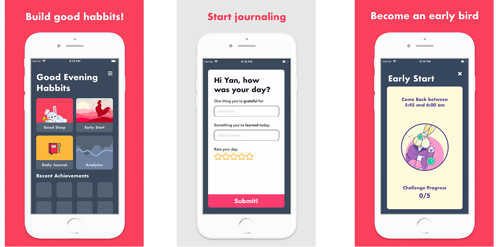

# Habbits

Build Habbits Today.



## Prerequisite:

First you need to install command line tools, if not, read [this article](http://railsapps.github.io/xcode-command-line-tools.html).

Then Please follow these lines in this order:

1. Confirm that Xcode and command line tools are installed.
   ```
   xcode-select --version
   ```

2) Install homebrew
   ```
   /usr/bin/ruby -e "$(curl -fsSL https://raw.githubusercontent.com/Homebrew/install/master/install)"
   ```
3) Install watchman, flow, and create-react-app

   ```
   brew install watchman
   brew install flow
   npm install -g create-react-native-app
   ```

4) Install react native debugger

   ```
   brew update && brew cask install react-native-debugger
   ```

## Developement:

You basically use yarn dev in order to work with react-native-debugger.
Note that live reloading works only for the code within render method.
If your components are functional components, you may use live reloading instead.

    // open your app in development mode

    yarn dev

    // open ios simulater
    i

    // on the running emmulater
    // To show the developmer menu
    // enable live reloading, or hot reloading

    Command+D

## Created By:

- Tsuyoshi [GitHub](https://github.com/Akitsuyoshi)
- Michael [GitHub](https://github.com/MAkzent)
- Hiro [GitHub](https://github.com/m0m0i)
- Nour [GitHub](https://github.com/nourbalaha)
